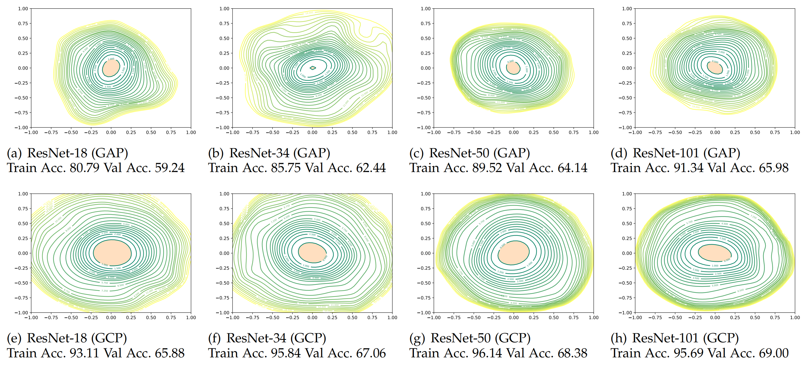
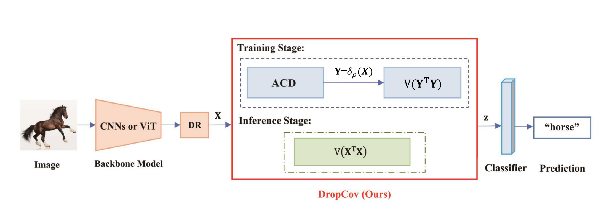
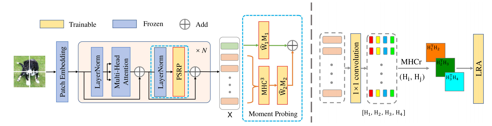
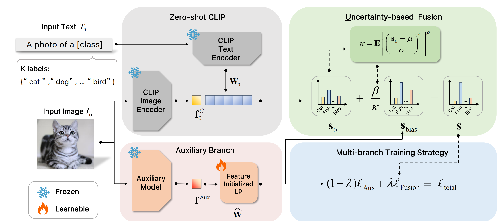
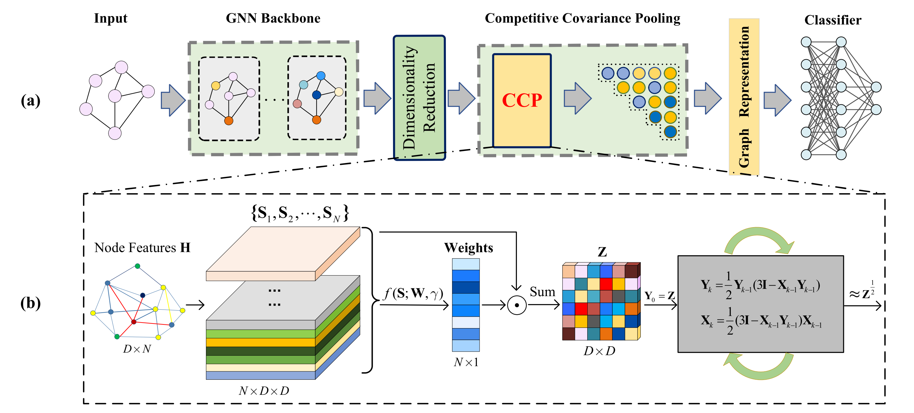

# Deep Second Order Network (MindSpore)

## Introduction
There are codes implementation of various deep second-order networks based on the mindspore architecture.  
●[Towards A Deeper Understanding of Global Covariance Pooling in Deep Learning: An Optimization Perspective](https://ieeexplore.ieee.org/document/10269023)   
<div align= "justify">In this paper, we make the effort towards understanding the effect of GCP on deep learning from an optimization perspective. we point out several merits
of deep GCP that have not been recognized previously or fully explored, including faster convergence, stronger model robustness and better generalization across tasks. </div>


● [DropCov: A Simple yet Effective Method for Improving Deep Architectures ](https://papers.nips.cc/paper_files/paper/2022/hash/d9888cc7baa04c2e44e8115588133515-Abstract-Conference.html)  
We explore the effect of post-normalization on GCP from the model optimization perspective, which encourages us to propose a simple yet effective normalization, namely DropCov.  

● [Tuning Pre-trained Model via Moment Probing](https://openaccess.thecvf.com/content/ICCV2023/html/Gao_Tuning_Pre-trained_Model_via_Moment_Probing_ICCV_2023_paper.html)    
This paper propose a novel Moment Probing (MP) method to further explore the potential of Linear Probing(LP). Distinguished from LP which builds a linear classification head based on the mean of final features (e.g., word tokens for ViT) or classification tokens, our MP performs a linear classifier on feature distribution, which provides the stronger representation ability by exploiting richer statistical information inherent in features.  

● [AMU-Tuning: Effective Logit Bias for CLIP-based Few-shot Learning](https://arxiv.org/abs/2404.08958)    
This paper disassemble three key components involved in computation of logit bias (i.e., logit features, logit predictor, and logit fusion) and empirically analyze the effect on performance of few-shot classification. Based on analysis of key components, this paper proposes a novel AMU-Tuning method to learn effective logit bias for CLIP-based few-shot classification.

● [CCP-GNN: Competitive Covariance Pooling for Improving Graph Neural Networks](https://ieeexplore.ieee.org/document/10509794)    
This article proposes a novel competitive covariance pooling (CCP) based on observation of graph structures, i.e., graphs generally can be identified by a (small) key part of nodes. To this end, our CCP generates node-level second-order representations to explore rich statistics inherent in node features, which are fed to a competitive-based attention module for effectively discovering key nodes through learning node weights. Subsequently, our CCP aggregates nodelevel second-order representations in conjunction with node weights by summation to produce a covariance representation for each graph, while an iterative matrix normalization is introduced to consider geometry of covariances.


## Usage

### Environments
●OS：18.04  
●CUDA：11.6  
●Toolkit：mindspore1.9  
●GPU:GTX 3090 


### Install
●First, Install the driver of NVIDIA  
●Then, Install the driver of CUDA  
●Last, Install cudnn

create virtual enviroment mindspore
conda create -n mindspore python=3.7.5 -y
conda activate mindspore
CUDA 10.1 
```bash
conda install mindspore-gpu cudatoolkit=10.1 -c mindspore -c conda-forge
```
CUDA 11.1 
```bash
conda install mindspore-gpu cudatoolkit=11.1 -c mindspore -c conda-forge
```
validataion 
```bash
python -c "import mindspore;mindspore.run_check()"
```

### Data preparation
Download and extract ImageNet train and val images from http://image-net.org/. (https://pytorch.org/docs/stable/torchvision/datasets.html#imagefolder), and the training and validation data is expected to be in the `train/` folder and `val/` folder respectively:


```
/path/to/imagenet/
  train/
    class1/
      img1.jpeg
    class2/
      img2.jpeg
  val/
    class1/
      img3.jpeg
    class/2
      img4.jpeg
```
### Evaluation
To evaluate a pre-trained model on ImageNet val with GPUs run:

```
CUDA_VISIBLE_DEVICES={device_ids}  python eval.py --data_path={IMAGENET_PATH} --checkpoint_file_path={CHECKPOINT_PATH} --device_target="GPU" --config_path={CONFIG_FILE} &> log &
```

### Training

#### Train with ResNet

You can run the `main.py` to train as follow:

```
mpirun --allow-run-as-root -n {RANK_SIZE} --output-filename log_output --merge-stderr-to-stdout python train.py  --config_path={CONFIG_FILE} --run_distribute=True --device_num={DEVICE_NUM} --device_target="GPU" --data_path={IMAGENET_PATH}  --output_path './output' &> log &
```
For example:

```bash
mpirun --allow-run-as-root -n 4 --output-filename log_output --merge-stderr-to-stdout python train.py  --config_path="./config/resnet50_imagenet2012_config.yaml" --run_distribute=True --device_num=4 --device_target="GPU" --data_path=./imagenet --output_path './output' &> log &
```


## Our Works

|Works         | Paper | Code|                                                         
| ------------------ | ----- | ------- | 
| Towards a Deeper Understanding of Global Covariance Pooling in Deep Learning: An Optimization Perspective  |  [Link](https://ieeexplore.ieee.org/document/10269023)|[Link](https://github.com/Terror03/GCP-OPT)   |
| DropCov: A Simple yet Effective Method for Improving Deep Architectures   | [Link](https://papers.nips.cc/paper_files/paper/2022/hash/d9888cc7baa04c2e44e8115588133515-Abstract-Conference.html)  |   [Link](https://github.com/Sherry1945/Dropcov_mindspore)   |
|Tuning Pre-trained Model via Moment Probing   |  [Link](https://openaccess.thecvf.com/content/ICCV2023/html/Gao_Tuning_Pre-trained_Model_via_Moment_Probing_ICCV_2023_paper.html)   |  [Link](https://github.com/Sherry1945/MP_Mindspore)  |
| AMU-Tuning: Effective Logit Bias for CLIP-based Few-shot Learning   | [Link](https://arxiv.org/abs/2404.08958)  |   [Link](https://github.com/TJU-sjyj/AMU-Tuning)   |
|CCP-GNN: Competitive Covariance Pooling for Improving Graph Neural Networks |  [Link](https://ieeexplore.ieee.org/document/10509794)   |  [Link]()  |


## References
[GCP_OPT]Qilong Wang , Zhaolin Zhang,Mingze Gao, Jiangtao Xie,Pengfei Zhu, Peihua Li, Wangmeng Zuo, and Qinghua Hu. "Towards A Deeper Understanding of Global Covariance Pooling in Deep Learning: An Optimization Perspective." IEEE Transactions on Pattern Analysis and Machine Intelligence(TPAMI). 2023 .

[DropCov] Qilong Wang, Mingze Gao, Zhaolin Zhang, Jiangtao Xie, Peihua Li, and Qinghua Hu. "DropCov: a simple yet effective method for improving deep architectures." Advances in Neural Information Processing Systems(NeurIPS): 33576-33588. 2022.

[MP] Mingze Gao, Qilong Wang, Zhenyi Lin, Pengfei Zhu, Qinghua Hu, Jingbo Zhou. "Tuning Pre-trained Model via Moment Probing." Proceedings of the IEEE/CVF International Conference on Computer Vision(ICCV). 2023.  

[AMU-Tuning] Yuwei Tang, Zhenyi Lin, Qilong Wang, Pengfei Zhu, Qinghua Hu. "AMU-Tuning: Effective Logit Bias for CLIP-based Few-shot Learning."  IEEE/CVF Conference on Computer Vision and Pattern Recognition(CVPR). 2024.

[CCP-GNN]  Pengfei Zhu; Jialu Li; Zhe Dong; Qinghua Hu; Xiao Wang; Qilong Wang. "CCP-GNN: Competitive Covariance Pooling for Improving Graph Neural Networks." IEEE Transactions on Neural Networks and Learning Systems(TNNLS). 2024.
